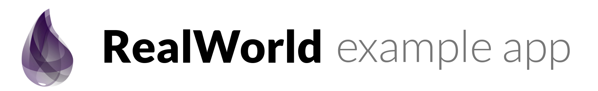

# 

[](http://realworld.io)

> Elixir (Phoenix Surface) codebase containing real world examples (CRUD, auth, advanced patterns, etc) that adheres to the [RealWorld](https://github.com/gothinkster/realworld-example-apps) spec and API.


### [Demo]()&nbsp;&nbsp;&nbsp;&nbsp;[RealWorld](https://github.com/gothinkster/realworld)


This codebase was created to demonstrate a frontend application built with **Elixir and Phoenix Surface** including CRUD operations, authentication, routing, pagination, and more.

For more information on how to this works with other frontends/backends, head over to the [RealWorld](https://github.com/gothinkster/realworld) repo.


# How it works

Surface is a **server-side rendering** component library that allows developers to
build **rich interactive user-interfaces**, writing minimal custom Javascript.

Built on top of [Phoenix LiveView](https://hexdocs.pm/phoenix_live_view/) and its new
[LiveComponent](https://hexdocs.pm/phoenix_live_view/Phoenix.LiveComponent.html), Surface
leverages the amazing Phoenix Framework to provide a **fast** and **productive** solution to build
modern web applications.

## Installing / Getting started

To run this project, you will need to install the following dependencies on your system:

* [Elixir](https://elixir-lang.org/install.html)
* [Phoenix](https://hexdocs.pm/phoenix/installation.html)

To get started, run the following commands in your project folder.

Clone the repository:

```sh
git clone https://github.com/razuf/elixir-phoenix-surface-realworld.git
cd elixir-phoenix-surface-realworld/
```

Install the dependencies:

```sh
mix deps.get
```

Build and run a local development server:

```sh
mix phx.server
```


## Open in your browser

This is a frontend project, you can go to http://localhost:4000 and see this aplication. 

# 

This is connected to the standard [Conduit](https://demo.realworld.io/#/) backend `https://conduit.productionready.io/api`.

In order to connect other [Conduit](https://demo.realworld.io/#/) backends you can download and setup one of the [backend projects](https://demo.realworld.io/#/) and set it up as api for this app. Typically this can be done by finding the localhost url and port e.g. `localhost:9000` and then put it into:

http://localhost:4000/backend_api_url 


## Tests

It's on my list to improve. 

## Documentation

Needs to be done... 

## Licensing

MIT © Ralph Zühlsdorf